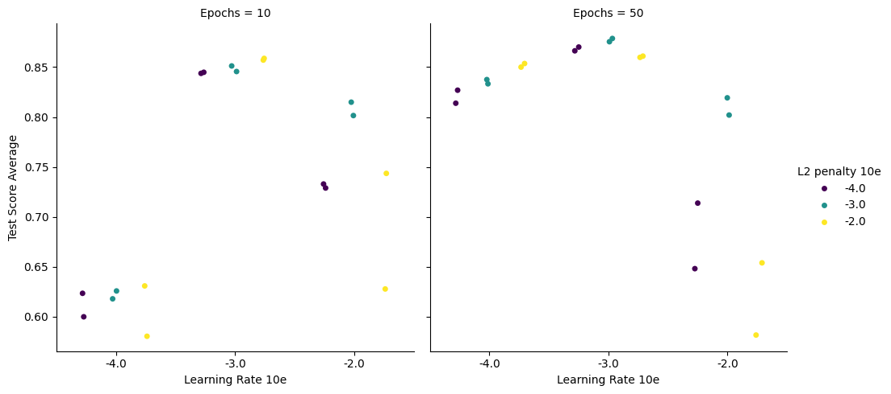

Advanced code usage examples
============================

All major classes and functions that make up MINE are readily importable into user code for advanced integration.
The example below is also available
as a `Google Colab notebook <https://colab.research.google.com/drive/1zNiUyPpe5gH1WYbQqut1TrBItj-Ovmw1?usp=sharing>`_.
It illustrates directly importing MINE classes and functions for the purpose of fitting hyper parameters via an
exhaustive grid search.

For practical purposes, a grid search is likely not efficient enough and more advanced methods such as
evolutionary algorithms will get to the best solution faster while searching a larger parameter domain.

**Note**: hyper parameters should be optimized on a separate validation set that is not used for regular training/testing.

Optional: Download test data
############################
.. code-block:: bash

    wget https://zenodo.org/records/21851176/files/fit_test_predictors.csv?download=1 -O //data_path//fit_test_predictors.csv
    wget https://zenodo.org/records/21851176/files/fit_test_responses.csv?download=1 -O //data_path//fit_test_responses.csv

Import necessary modules
########################
.. code-block:: python

    import neuro_mine as nm  # top-level import of everything neuro-mine
    import numpy as np
    import seaborn as sns
    import matplotlib.pyplot as pl
    from os import path

All importable objects from neuro-mine can be accessed from the top level ``neuro_mine``

**Note**: ``seaborn`` is not installed during installation of ``neuro-mine`` and has to be seperately installed in the
environment if the plotting code at the bottom is to be executed.

Load and prepare data
#####################

.. code-block:: python

    # Load and pre-process data from datafiles - load_and_pre_process_data expects lists of filenames
    p_file = path.join("data_path", "fit_test_predictors.csv")
    r_file = path.join("data_path", "fit_test_responses.csv")
    is_spike_data, ip_pred_data, ip_resp_data, ip_time, pred_header, resp_header = nm.load_and_pre_process_data([p_file],
                                                                                                             [r_file],
                                                                                                             is_episodic=False,
                                                                                                             downsampling=1)
    # Standardize the data and remove time columns unless they shoudl be used as a predictor if time_as_pred=True
    mine_pred, mine_resp, m_pred, s_pred, m_resp, s_resp = nm.standardize_data(ip_pred_data, ip_resp_data, time_as_pred=False,
                                                                            is_episodic=False, is_spike_data=is_spike_data)

| ``is_spike_data``: True if responses are spikes/events, False otherwise
| ``ip_pred_data``: np.ndarray, the predictor data after interpolation to a common timebase
| ``ip_resp_data``: np.ndarray, the response data after interpolation to a common timebase
| ``ip_time``: The timebase of the interpolation
| ``pred_header``: The names of each column in the predictor datafile
| ``resp_header``: The names of the each column in the response datafile

| ``mine_pred``: np.ndarray, the predictor data after setting column means to 0 and standard deviations to 1; if time_as_pred is set to False, time column will have been stripped
| ``mine_resp``: np.ndarray, the response data after the same standardization, time column will always have been stripped
| ``m_pred, s_pred, m_resp, s_resp``: Vectors that contain the original averages and standard deviations to undo/reapply standardization during predictions

Define constants and hyperparameters to test
############################################

.. code-block:: python

    model_history = 50  # 50 timepoints in the model history is standard for the test data, however this parameter could be optimized as well
    # We won't perform any Taylor analysis in this example, however values should still be set
    taylor_look_ahead = 25
    taylor_pred_every = model_history
    learning_rates = [1e-4, 1e-3, 1e-2]
    l2_penalties = [1e-4, 1e-3, 1e-2]
    epochs = [10, 50]
    # Since network learning starts from a set of randomly initialized weights, we want to average data across multiple fits
    n_iterations = 2

**Note**: For user data the ``model_history`` parameter must be adjusted. ``model_history`` is in seconds and 50 is
therefore a large value for most intents and purposes. It just so happens that the time in the test data is
arbitrarily set as 1 second per timepoint.

Fit data on each point in the hyper parameter grid
##################################################

.. code-block:: python

    # In this example, our metric will be the average achieved test score across all responses
    d_scores = {
        "Learning Rate 10e": [],
        "L2 penalty 10e": [],
        "Epochs": [],
        "Test Score Average": []
    }

    total_iterations = n_iterations * len(epochs) * len(learning_rates) * len(l2_penalties)
    n_completed = 0

    for _ in range(n_iterations):
      for ep in epochs:
        for lr in learning_rates:
          for l2 in l2_penalties:
            d_scores["Epochs"].append(ep)
            d_scores["Learning Rate 10e"].append(np.log10(lr))
            d_scores["L2 penalty 10e"].append(np.log10(l2))
            miner = nm.Mine(train_fraction=0.8,
                            model_history=model_history,
                            score_cut=np.sqrt(0.5),  # NOTE: This parameter does not matter, we collect all test scores and average them
                            compute_taylor=False,  # NOTE: Since we only want test scores, we don't bother spending time computing taylor metrics
                            return_jacobians=False,
                            taylor_look_ahead=taylor_look_ahead,
                            taylor_pred_every=taylor_pred_every,
                            fit_spikes=is_spike_data)
            miner.n_epochs = ep
            miner.learning_rate = lr
            miner.l2_penalty = l2
            miner.verbose = False  # don't print individual unit training updates
            mdata = miner.analyze_data(mine_pred, mine_resp)
            if is_spike_data:
              test_score = mdata.roc_auc_test
            else:
              test_score = mdata.correlations_test
            # test correlations are NaN if the network prediction is flat - we therefore replace these with 0 since they make the wrong prediction
            test_score[np.isnan(test_score)] = 0
            d_scores["Test Score Average"].append(np.mean(test_score))
            n_completed += 1
            print("###")
            print(f"Completed {np.round(n_completed/total_iterations*100, 1)}% of all fits")
            print("###")
            print()

Depending on whether the data was spiking/event data or continuous, either the ROC AUC score or the correlation on test
data will be used to judge model quality. This avoids adjusting hyperparameters to optimize training and rather
attempts to optimize them for generalization of the model.

Plot results
############

.. code-block:: python

    pl.figure()
    sns.catplot(data=d_scores, x="Learning Rate 10e", y="Test Score Average", hue="L2 penalty 10e", col="Epochs", sharey=True, dodge=True, palette="viridis")

Example outcome on test data:
-----------------------------

In this example, on the test data, the highest score was achieved when training for 50 epochs (right panel) with
a learning rate of 0.001 and an L2 penalty of 0.001, which are the current defaults.

**Note**: As shown above, the learning rate and L2 penalty on the weights (weight-decay) can be set after generating the
``Mine`` class. It is currently not possible to modify these hyper parameters when running the training or prediction
scripts.
