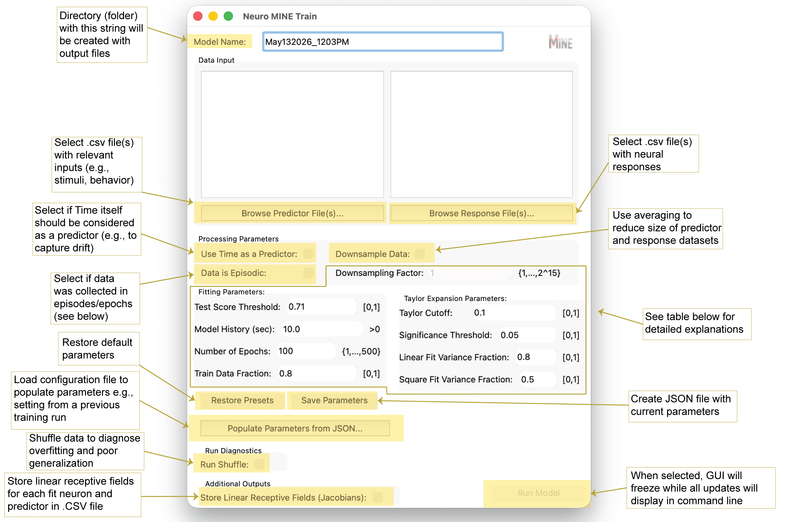
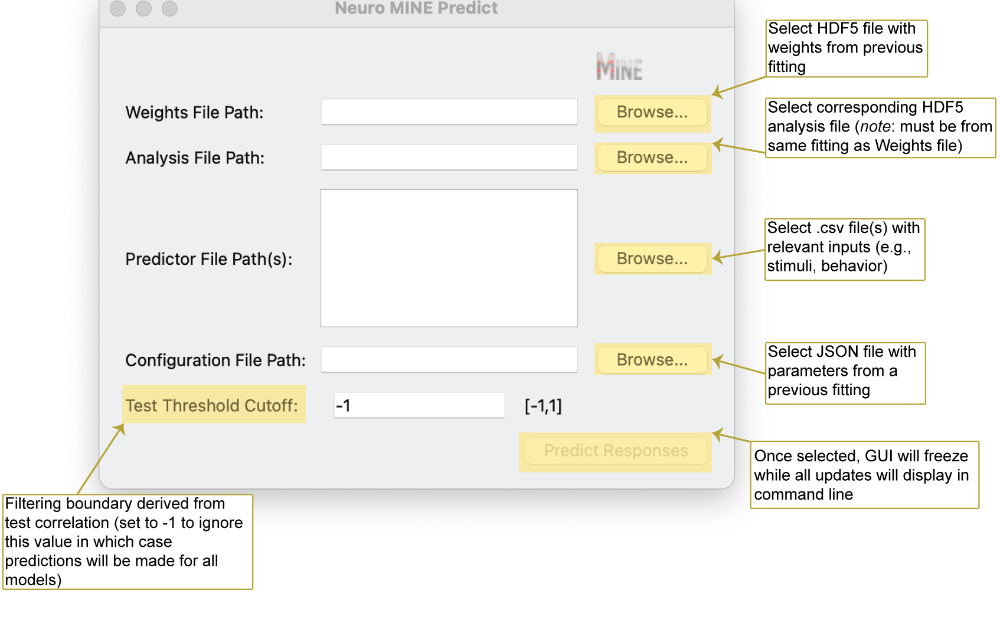

.. _home:

=========================
Neuro-MINE Documentation
=========================

.. image:: https://img.shields.io/pypi/v/neuro-mine
   :target: https://pypi.org/project/neuro-mine/
   :alt: PyPI - Version
.. image:: https://img.shields.io/github/license/matovic5/neuro_mine
   :target: https://github.com/matovic5/neuro_mine/blob/main/LICENSE.txt
   :alt: GitHub License

**Neuro-MINE** (Model Identification of Neural Encoding) is a tool for analyzing neural response data
and making statistical inferences.

Neuro-MINE allows users to train a flexible, convolutional neural network (CNN)
to analyze experimental datasets containing neural activity and corresponding predictors
(e.g., behavioral responses).

It also allows for predictions of neural responses from a previously fit model for hypothesis generation.

Use Cases:
    - Any model organism
    - Any type of predictor data (stimuli and/or behavior)
    - Any type of response data (imaging or spikes)
    - Episodic or non-episodic data
    - Generate response predictions from new inputs using an existing model
    - While all descriptions reference neurons, neuro-mine can process any time-varying data

Data Requirements:
    - Input file types: Any delimited file format such as comma-separated value, tab-separated value, etc. with time-varying data
    - All input files must be organized such that features are across columns and timepoints are across rows
    - Predictor data **must** have time as the first column; for easily interpretable outputs, predictor columns should be meaningfully labelled (e.g., 'temperature' or 'left_paw') in the header
    - Response data **must** have time as the first column and the responses must be in adjacent columns; column titles (a header) are supported but are not mandatory
    - Within episodes, data must be continuous in time, and time must be monotonically increasing
    - Common time encodings are supported but note that if times are recorded without dates and/or AM/PM designations, ordering of timepoints can be ambiguous.
    - Furthermore, time encoding **must** match between predictor and response files such that predictor times can be aligned with response times

.. note::
    ️Ambiguities in the time column will lead to failures: Be mindful of rounding when saving data to CSV which can assign the same time values to successive timepoints.

------------

Quick Start
==============

Create an environment using Python v3.9:

.. code-block:: bash

   conda create -n mine python=3.9

.. note::
   If this step is skipped, Tensorflow>2.15.1 should not already be installed in the existing environment.

Activate environment

.. code-block:: bash

   conda activate mine

Install/upgrade Neuro-MINE from PyPi

.. code-block:: bash

    pip install -U neuro_mine

------------

Neuro-MINE for Training
==============

Launch GUI for model training

.. code-block:: bash

    Mine

Possible command line arguments for fitting with Neuro-MINE

.. code-block:: bash

    Mine -p <predictor directory or filepath(s)> -r <respose directory or filepath(s)> -ut <use time> -sh <run shuffle> -ct <test score threshold> -ts <Taylor significance> -la <linear fit variance fraction> -lsq <square fit variance fraction> -n <name of model> -mh <model history (seconds)> -tl <Taylor lookahead> -j <Store Jacobians> -o <JSON filepath with existing parameters>  -e <number of epochs> -mq <non-verbose in terminal> -mtf <fraction of data for training vs testing> -eps <data is eposidic> -dsf <downsampling factor?

See command line prompts to customize the model

.. code-block:: bash

    Mine --help

Training GUI Explanation

Training Parameter Explanation

.. list-table:: Model Parameters
   :header-rows: 1
   :widths: 25 75

   * - Name
     - Explanation

   * - Downsampling Factor [-dsf]
     - Reduces size of predictor and response datasets by averaging according to the specified factor, which increases processing speed and decreases runtime. E.g., if the dataset has 10,000 rows, setting the Downsampling Factor to 10 will average every 10 rows around the center, sample every 10th row for time, and reduce the data set to 1000 rows overall.

       If dataset size exceeds computational memory, the program will not be able to run and a downsampling factor will be recommended in the command line.

   * - Test Score Threshold [-ct]
     - Sets the minimal correlation between model predictions and true outcomes needed on test data to consider a response “fit.” Changing this value will have the greatest influence on results because it filters responses whose test correlation is below the threshold.

       Currently set to the square root of 0.5 (√0.5), indicating that the prediction explains 50% of the variance in the data. Empirically, this threshold yielded a >90-fold enrichment of true over false positives.

   * - Model History [-mh]
     - Number of seconds of past data used for fitting (higher history increases runtime). Set this based on expectations about how far in the past events might influence current neural activity.

       **Note:** Inputs are currently limited to past events. For motor outputs, anticipatory activity might require future inputs (negative history). While not supported, a similar effect can be achieved by time-shifting predictors relative to responses (Costabile et al., 2023).

   * - Number of Epochs [-e]
     - Number of iterations used to fit the model over the entire training dataset.

       Default is 100 for an intermediate-size dataset. Larger datasets typically require fewer epochs to detect patterns, and smaller datasets may require more.

   * - Train Data Fraction [-mtf]
     - Fraction of data used for training (the remainder is used for testing).

       *Note on generalization:* If the input data is periodic, test score correlations still indicate fit quality. However, to test generalization, predictors in the test period should differ from those in training.

       *Note on episodic data:* Train/test sets are split by episodes. For example, if an experiment contains 10 episodes, the first 8 are used for training and the last 2 for testing at the default value.

   * - Taylor Cutoff [-tc]
     - Minimal fraction of variance explained that must be lost for a predictor to be considered driving a response.

       A value of 0.1 is a sensible default when neurons respond robustly. If responses are expected to be stochastic, a value of 0 may be more appropriate.

   * - Significance Threshold [-ts]
     - After correcting for multiple comparisons, the loss in explained variance must be significantly larger than the **Cutoff** at this p-value for a predictor to be considered driving a response.

   * - Look Ahead [-tl]
     - Sets the time over which the Taylor expansion will predict into the future as a fraction of model history.

       The default value of 0.5 means that for a 10-second long history, Taylor expansion will be used to predict 5 seconds into the future.

       Increasing this value decreases prediction fidelity and can lead to unstable predictor assignments. Lowering it toward 0 improves prediction accuracy but may reduce stability because predictions become trivial.

   * - Linear Fit Variance Fraction [-la]
     - Threshold on the fraction of variance explained by a linear expansion of the model. If crossed, the neural response is classified as **linear**.

   * - Square Fit Variance Fraction [-lsq]
     - Threshold on the fraction of variance explained by a second-order expansion.

       If crossed (and the linear threshold is not), the response is classified as **second order** (“square” in insights). If neither threshold is crossed, the response is reported as **cubic+**, indicating higher than second order.

------------

Neuro-MINE for Predictions
==============

Launch GUI for response prediction

.. code-block:: bash

    Mine-predict

Possible command line arguments for prediction with Neuro-MINE

.. code-block:: bash

    Mine-predict -p <predictor directory or filepath(s)> -o <JSON filepath with model parameters> -w <hdf5 filepath with weights> -a <hdf5 filepath with analysis of fit> -ct <test score threshold>

See possible command line prompets to parametrize the prediction

.. code-block:: bash

    Mine-predict --help

Prediction GUI Explanation

------------

Advanced code usage examples
==============

All major classes and functions that make up MINE are readily importable into user code for advanced integration.

Import of MINE class for direct access to fit object:

.. code-block:: bash

    import neuro_mine as nm
    # load predictors and responses from desired files
    # predictors: List[n_timepoints long predictors]
    # responses: Array[n_responses x n_timepoints]
    # Note: At this level history and taylor look-ahead are provided in frames not time units
    miner = nm.Mine(train_fraction=2/3, model_history=50, score_cut=0.71, compute_taylor=True, return_jacobians=False,
                    taylor_look_ahead=25, taylor_pred_every=5, fit_spikes=False)
    mdata = miner.analyze_data(predictors, responses)
    # process mdata object in further code

In addition, the underlying CNN model can be imported directly:

.. code-block:: bash

    import neuro_mine as nm
    # Note: input_length is the same as model history
    # This approach allows customizing the complexity of the model
    model = nm.ActivityPredictor(n_units=1024, n_conv=150, drop_rate=0.5, input_length=50, activation="swish",
                                 predict_spikes=True)
    # Note: the datacount input is unused
    nm.train_model(model, train_data, n_epochs=50, datacount=0)
    # Further processing on model object, e.g. calculating linear derivative of the output with respect
    # to all inputs in the neighborhood of X0
    nm.dca_dr(model, X0)

------------

Links
========

- Source code: https://github.com/matovic5/neuro_mine
- PyPI: https://pypi.org/project/neuro-mine/
- Issue tracker: https://github.com/matovic5/neuro_mine/issues

------------

About the Project
====================

Neuro-MINE was created for neuroscientists by neuroscientists.

If you use this package in your research, please consider citing:

.. code-block:: text

   Costabile JD, Balakrishnan KA, Schwinn S, Haesemeyer M. Model discovery to link neural activity to behavioral tasks. Elife. 2023 Jun 6;12:e83289. doi: 10.7554/eLife.83289. PMID: 37278516; PMCID: PMC10310322. https://elifesciences.org/articles/83289

.. note::
   This documentation is a work in progress. Contributions and feedback are welcome.
