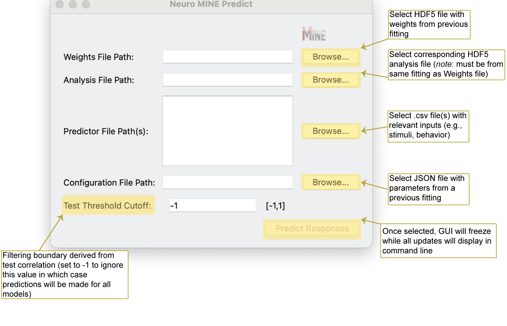

Prediction Module
=========================

Launch GUI for response prediction

.. code-block:: bash

    Mine-predict

Possible command line arguments for prediction with Neuro-MINE

.. code-block:: bash

    Mine-predict -p <predictor directory or filepath(s)> -o <JSON filepath with model parameters> -w <hdf5 filepath with weights> -a <hdf5 filepath with analysis of fit> -ct <test score threshold>

See possible command line prompts to parametrize the prediction

.. code-block:: bash

    Mine-predict --help

Prediction GUI Explanation

