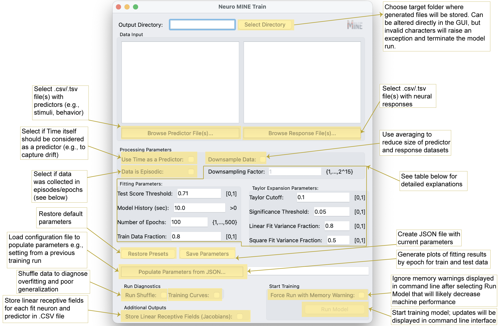

Training Module
===============

Launch GUI for model training

.. code-block:: bash

    Mine

Possible command line arguments for fitting with Neuro-MINE

.. code-block:: bash

    Mine -p <predictor directory or filepath(s)> -r <response directory or filepath(s)> -od <output directory> -ut <use time> -sh <run shuffle> -ct <test score threshold> -ts <Taylor significance> -la <linear fit variance fraction> -lsq <square fit variance fraction> -mh <model history (seconds)> -tl <Taylor lookahead> -tc <Taylor cutoff> -j <Store Jacobians> -o <JSON filepath with existing parameters> -e <number of epochs> -mq <non-verbose in terminal> -mtf <fraction of data for training vs testing> -eps <data is episodic> -dsf <downsampling factor> -imw <ignore memory warning and force run> -z <plot training curves>

See command line prompts to customize the model

.. code-block:: bash

    Mine --help

Training GUI Explanation

Training Parameter Explanation

.. list-table:: Model Parameters
   :header-rows: 1
   :widths: 25 75

   * - Name
     - Explanation

   * - Downsampling Factor [-dsf]
     - Reduces size of predictor and response datasets by averaging according to the specified factor, which increases processing speed and decreases runtime. E.g., if the dataset has 10,000 rows, setting the Downsampling Factor to 10 will average every 10 rows around the center, sample every 10th row for time, and reduce the data set to 1000 rows overall.

       If dataset size exceeds computational memory, the program will not be able to run and a downsampling factor will be recommended in the command line.

   * - Test Score Threshold [-ct]
     - Sets the minimal correlation between model predictions and true outcomes needed on test data to consider a response “fit.” Changing this value will have the greatest influence on results because it filters responses whose test correlation is below the threshold.

       Currently set to the square root of 0.5 (√0.5), indicating that the prediction explains 50% of the variance in the data. Empirically, this threshold yielded a >90-fold enrichment of true over false positives.

   * - Model History [-mh]
     - Number of seconds of past data used for fitting (higher history increases runtime). Set this based on expectations about how far in the past events might influence current neural activity.

       **Note:** Inputs are currently limited to past events. For motor outputs, anticipatory activity might require future inputs (negative history). While not supported, a similar effect can be achieved by time-shifting predictors relative to responses (Costabile et al., 2023).

   * - Number of Epochs [-e]
     - Number of iterations used to fit the model over the entire training dataset.

       Default is 100 for an intermediate-size dataset. Larger datasets typically require fewer epochs to detect patterns, and smaller datasets may require more.

   * - Train Data Fraction [-mtf]
     - Fraction of data used for training (the remainder is used for testing).

       *Note on generalization:* If the input data is periodic, test score correlations still indicate fit quality. However, to test generalization, predictors in the test period should differ from those in training.

       *Note on episodic data:* Train/test sets are split by episodes. For example, if an experiment contains 10 episodes, the first 8 are used for training and the last 2 for testing at the default value.

   * - Taylor Cutoff [-tc]
     - Minimal fraction of variance explained that must be lost for a predictor to be considered driving a response.

       A value of 0.1 is a sensible default when neurons respond robustly. If responses are expected to be stochastic, a value of 0 may be more appropriate.

   * - Significance Threshold [-ts]
     - After correcting for multiple comparisons, the loss in explained variance must be significantly larger than the **Cutoff** at this p-value for a predictor to be considered driving a response.

   * - Look Ahead [-tl]
     - Sets the time over which the Taylor expansion will predict into the future as a fraction of model history.

       The default value of 0.5 means that for a 10-second long history, Taylor expansion will be used to predict 5 seconds into the future.

       Increasing this value decreases prediction fidelity and can lead to unstable predictor assignments. Lowering it toward 0 improves prediction accuracy but may reduce stability because predictions become trivial.

   * - Linear Fit Variance Fraction [-la]
     - Threshold on the fraction of variance explained by a linear expansion of the model. If crossed, the neural response is classified as **linear**.

   * - Square Fit Variance Fraction [-lsq]
     - Threshold on the fraction of variance explained by a second-order expansion.

       If crossed (and the linear threshold is not), the response is classified as **second order** (“square” in insights). If neither threshold is crossed, the response is reported as **cubic+**, indicating higher than second order.

------------
